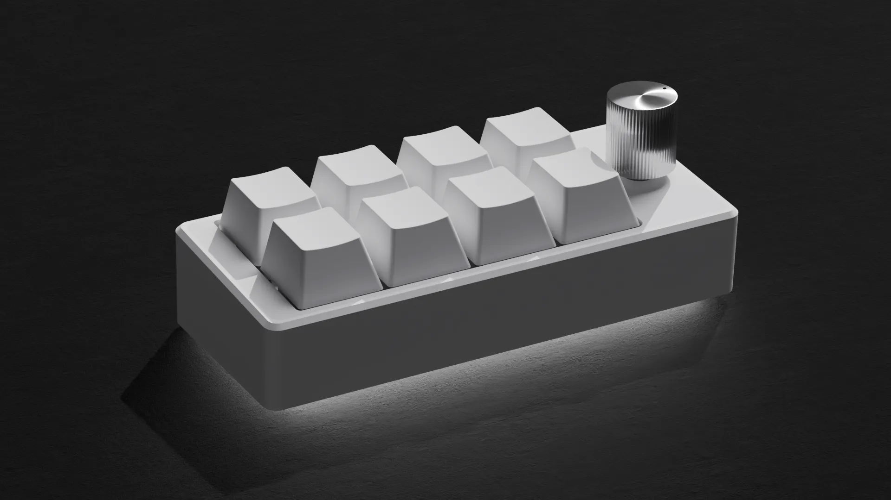

# Macro-Keyboard


完全自作マクロキーボード



---

## Features

* 基板からケースまで完全自作
* webページからキー割り当てを変更可能
* MXcherry hotswapに対応
* ロータリーエンコーダを搭載


## Firmware

[https://2k2e2n.github.io/macro-keyboard/config/](https://2k2e2n.github.io/macro-keyboard/config/)
👆にアクセスして書き換え

もしくは```dist/config/index.html```を開く

## Sales page
作成中